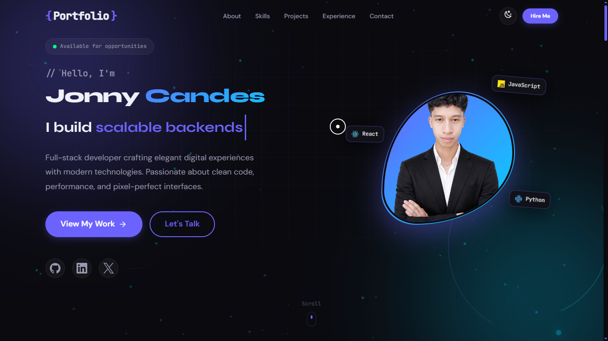

# Jonny Candes | Full-Stack Developer Portfolio



A modern, accessible portfolio website showcasing full-stack development skills and projects. Built with pure HTML, CSS, and JavaScript — no frameworks or bundlers.

## Features

- **Fully Responsive** - Adapts to all screen sizes with mobile-first design
- **Dark/Light Theme** - Toggle between themes with persistent preference
- **Smooth Animations** - Custom CSS animations and JavaScript-powered effects
- **Accessibility** - WCAG-compliant with ARIA attributes and keyboard navigation
- **Performance Optimized** - Vanilla JS, lazy loading, minification-ready
- **Interactive Elements** - Typewriter effect, skill bars, project modals, particles

## Tech Stack

| Category | Technologies |
|----------|-------------|
| **Frontend** | HTML5, CSS3 (Custom Properties, Grid, Flexbox), JavaScript (ES6+) |
| **UI/UX** | Custom responsive design, CSS animations, accessibility focused |
| **Icons** | [Iconify](https://iconify.design) - unified icon framework |
| **Deployment** | Vercel |

## Project Structure

```
Portfolio/
├── index.html              # Main entry point
├── resume.pdf              # Downloadable CV
├── assets/
│   ├── css/
│   │   ├── base.css        # Base styles and resets
│   │   ├── variables.css   # Design tokens (colors, typography, spacing)
│   │   ├── layout.css      # Grid and layout utilities
│   │   ├── components.css  # Reusable component styles
│   │   ├── animations.css  # Animation keyframes and utilities
│   │   ├── responsive.css  # Media queries and breakpoints
│   │   └── sections/       # Section-specific styles
│   └── js/
│       ├── main.js         # App initialization
│       ├── theme.js        # Theme toggle functionality
│       ├── navigation.js   # Mobile menu and smooth scrolling
│       ├── typewriter.js   # Typing animation effect
│       ├── animations.js   # Scroll-triggered animations
│       ├── skills.js       # Skills tab switching
│       ├── projects.js     # Project filtering and modals
│       ├── contact.js      # Contact form handling
│       ├── particles.js    # Hero section particle effects
│       └── utils.js        # Utility functions
└── assets/images/
    ├── profile/
    ├── projects/
    └── icons/
```

## Sections

1. **Hero** - Animated introduction with particles background
2. **About** - Personal introduction with stats (experience, projects, clients)
3. **Skills** - Tabbed interface (Frontend, Backend, Tools) with proficiency bars
4. **Projects** - Filterable project showcase with quick view modals
5. **Experience** - Timeline with work history and education
6. **Contact** - Contact form with validation

## Development

No build process required. Simply open `index.html` in a browser or serve locally.

### Local Development

```bash
# Using a simple HTTP server (Python)
python -m http.server 8000

# Or with any static server
npx serve .
```

## Browser Support

- Chrome (latest)
- Firefox (latest)
- Safari (latest)
- Edge (latest)

## License

MIT License - see [LICENSE](LICENSE) for details.

## Contributing

We welcome contributions! Please see [CONTRIBUTING.md](CONTRIBUTING.md) for guidelines on how to get started.